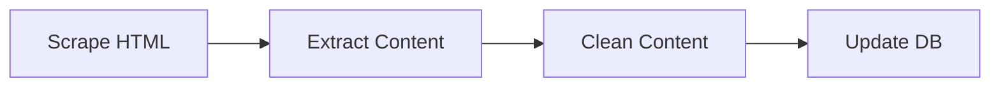

# Content Scraping Overview

Short: High-level steps for scraping and cleaning article content.

```mermaid
graph LR
    A[Scrape HTML] --> B[Extract Content]
    B --> C[Clean Content]
    C --> D[Update DB]
```
