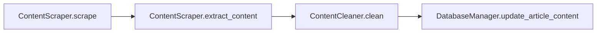

# Detailed Content Scraping

Short: Flow for scraping HTML content and storing it.

```mermaid
graph LR
    A[ContentScraper.scrape] --> B[ContentScraper.extract_content]
    B --> C[ContentCleaner.clean]
    C --> D[DatabaseManager.update_article_content]
```
