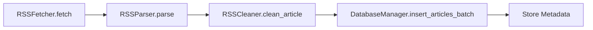

# Detailed RSS Processing

Short: RSS fetch → parse → clean → store metadata flow.

```mermaid
graph LR
    A[RSSFetcher.fetch] --> B[RSSParser.parse]
    B --> C[RSSCleaner.clean_article]
    C --> D[DatabaseManager.insert_articles_batch]
    D --> E[Store Metadata]
```
