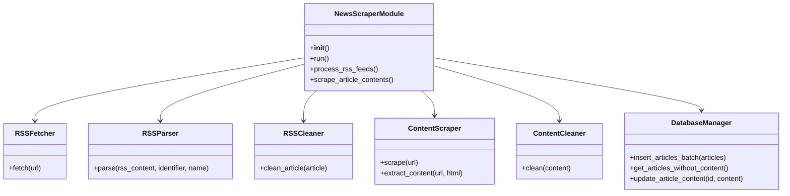

# Module 01 Class Diagram

Short: Class/component diagram for Module 01 (scraping & aggregation).

```mermaid
classDiagram
    class NewsScraperModule {
        +__init__()
        +run()
        +process_rss_feeds()
        +scrape_article_contents()
    }

    class RSSFetcher {
        +fetch(url)
    }

    class RSSParser {
        +parse(rss_content, identifier, name)
    }

    class RSSCleaner {
        +clean_article(article)
    }

    class ContentScraper {
        +scrape(url)
        +extract_content(url, html)
    }

    class ContentCleaner {
        +clean(content)
    }

    class DatabaseManager {
        +insert_articles_batch(articles)
        +get_articles_without_content()
        +update_article_content(id, content)
    }

    NewsScraperModule --> RSSFetcher
    NewsScraperModule --> RSSParser
    NewsScraperModule --> RSSCleaner
    NewsScraperModule --> ContentScraper
    NewsScraperModule --> ContentCleaner
    NewsScraperModule --> DatabaseManager
```
