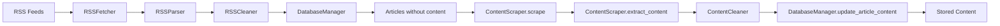

# Module 01 Data Flow

Short: Data flow for Module 01 (from RSS feed to stored content).

```mermaid
graph LR
    A[RSS Feeds] --> B[RSSFetcher]
    B --> C[RSSParser]
    C --> D[RSSCleaner]
    D --> E[DatabaseManager]
    E --> F[Articles without content]
    F --> G[ContentScraper.scrape]
    G --> H[ContentScraper.extract_content]
    H --> I[ContentCleaner]
    I --> J[DatabaseManager.update_article_content]
    J --> K[Stored Content]
```
