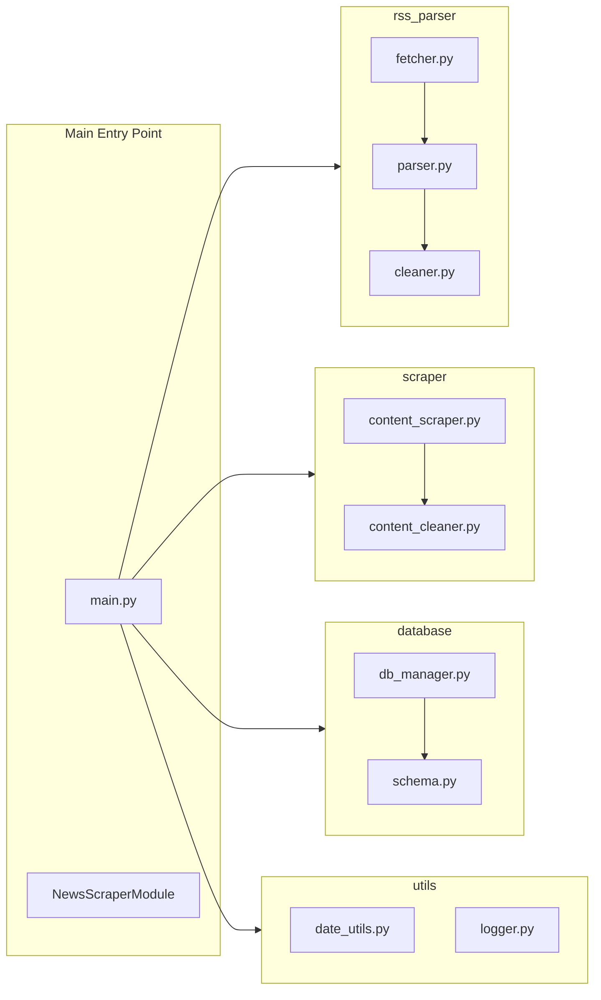

# Module 01 Detailed Architecture

Short: Detailed architecture diagram for Module 01 showing layers and components.

```mermaid
graph LR
    subgraph MainEntry[Main Entry Point]
        ME_main[main.py]
        ME_module[NewsScraperModule]
    end

    subgraph rss_parser
        RF_fetcher[fetcher.py] --> RP_parser[parser.py]
        RP_parser --> RC_cleaner[cleaner.py]
    end

    subgraph scraper
        S_cs[content_scraper.py] --> S_cc[content_cleaner.py]
    end

    subgraph database
        DB_mgr[db_manager.py] --> DB_schema[schema.py]
    end

    subgraph utils
        U_date[date_utils.py]
        U_log[logger.py]
    end

    ME_main --> rss_parser
    ME_main --> scraper
    ME_main --> database
    ME_main --> utils
```
