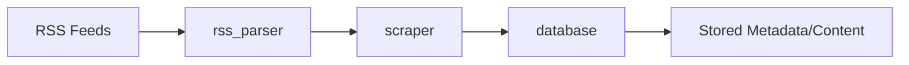

# Module 01 Overview

Short: High-level overview of Module 01 components and flow.

```mermaid
graph LR
    A[RSS Feeds] --> B[rss_parser]
    B --> C[scraper]
    C --> D[database]
    D --> E[Stored Metadata/Content]
```
