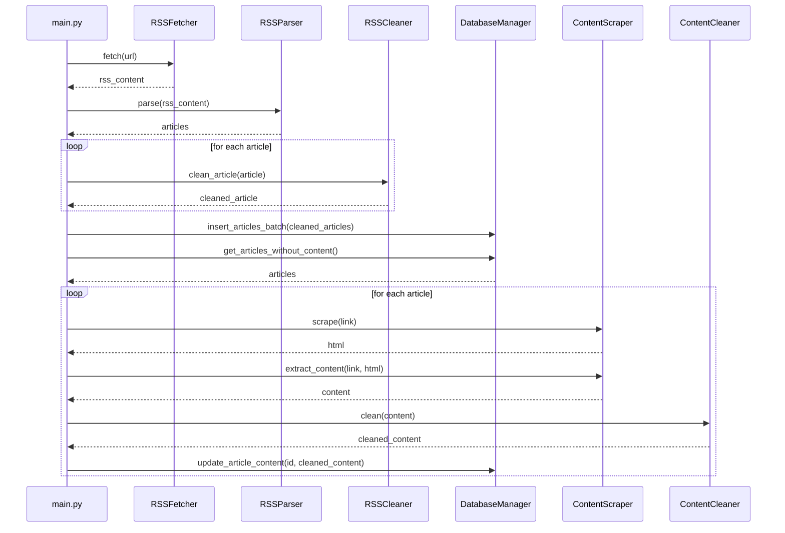

# Module 01 Sequence Diagram

Short: Sequence diagram for Module 01 scraping and content update flows.

```mermaid
sequenceDiagram
    participant M as main.py
    participant RF as RSSFetcher
    participant RP as RSSParser
    participant RC as RSSCleaner
    participant DB as DatabaseManager
    participant CS as ContentScraper
    participant CC as ContentCleaner

    M->>RF: fetch(url)
    RF-->>M: rss_content
    M->>RP: parse(rss_content)
    RP-->>M: articles
    loop for each article
        M->>RC: clean_article(article)
        RC-->>M: cleaned_article
    end
    M->>DB: insert_articles_batch(cleaned_articles)

    M->>DB: get_articles_without_content()
    DB-->>M: articles
    loop for each article
        M->>CS: scrape(link)
        CS-->>M: html
        M->>CS: extract_content(link, html)
        CS-->>M: content
        M->>CC: clean(content)
        CC-->>M: cleaned_content
        M->>DB: update_article_content(id, cleaned_content)
    end
```
