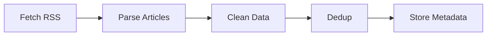

# RSS Processing Overview

Short: Overview of RSS fetch, parse, clean, dedup, and store steps.

```mermaid
graph LR
    A[Fetch RSS] --> B[Parse Articles]
    B --> C[Clean Data]
    C --> D[Dedup]
    D --> E[Store Metadata]
```
