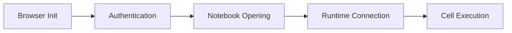

# Colab Automation Overview

Short: High-level overview of the Colab automation flow used by Module 03.

```mermaid
graph LR
    A[Browser Init] --> B[Authentication]
    B --> C[Notebook Opening]
    C --> D[Runtime Connection]
    D --> E[Cell Execution]
```
