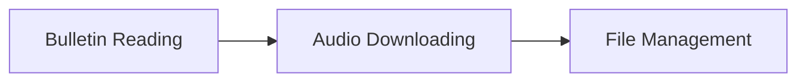

# Input/Output Handling Overview

Short: High-level IO flow for Module 03 (read → download → manage).

```mermaid
graph LR
    A[Bulletin Reading] --> B[Audio Downloading]
    B --> C[File Management]
```
