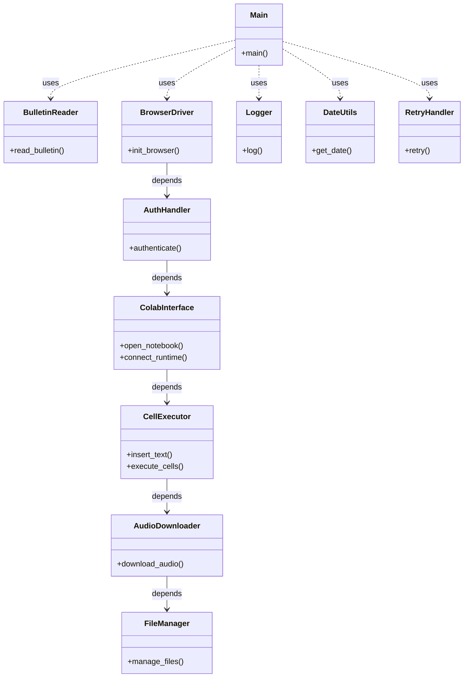

# Module 03 Class Diagram

Short: Class/component diagram for Module 03 (TTS automation via Colab).

```mermaid
classDiagram
    class Main {
        +main()
    }
    class BulletinReader {
        +read_bulletin()
    }
    class BrowserDriver {
        +init_browser()
    }
    class AuthHandler {
        +authenticate()
    }
    class ColabInterface {
        +open_notebook()
        +connect_runtime()
    }
    class CellExecutor {
        +insert_text()
        +execute_cells()
    }
    class AudioDownloader {
        +download_audio()
    }
    class FileManager {
        +manage_files()
    }
    class Logger {
        +log()
    }
    class DateUtils {
        +get_date()
    }
    class RetryHandler {
        +retry()
    }
    Main ..> BulletinReader : uses
    Main ..> BrowserDriver : uses
    BrowserDriver --> AuthHandler : depends
    AuthHandler --> ColabInterface : depends
    ColabInterface --> CellExecutor : depends
    CellExecutor --> AudioDownloader : depends
    AudioDownloader --> FileManager : depends
    Main ..> Logger : uses
    Main ..> DateUtils : uses
    Main ..> RetryHandler : uses
```
