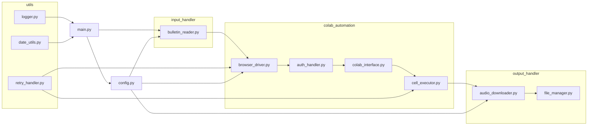

# Module 03 Detailed Architecture

Short: Detailed architecture for Module 03 showing automation, IO, and utils.

```mermaid
graph LR
    M_main[main.py] --> C_config[config.py]
    subgraph input_handler
        IH[bulletin_reader.py]
    end
    subgraph colab_automation
        CA1[browser_driver.py]
        CA2[auth_handler.py]
        CA3[colab_interface.py]
        CA4[cell_executor.py]
    end
    subgraph output_handler
        OH1[audio_downloader.py]
        OH2[file_manager.py]
    end
    subgraph utils
        U1[logger.py]
        U2[date_utils.py]
        U3[retry_handler.py]
    end
    M_main --> IH
    IH --> CA1
    CA1 --> CA2
    CA2 --> CA3
    CA3 --> CA4
    CA4 --> OH1
    OH1 --> OH2
    U1 --> M_main
    U2 --> M_main
    U3 --> CA1
    U3 --> CA4
    C_config --> IH
    C_config --> CA1
    C_config --> OH1
```
