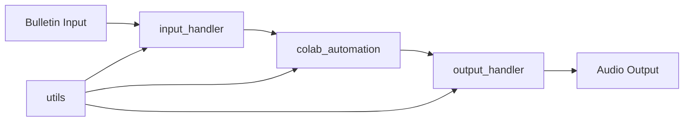

# Module 03 Overview

Short: High-level overview of Module 03 components and flows.

```mermaid
graph LR
    A[Bulletin Input] --> B[input_handler]
    B --> C[colab_automation]
    C --> D[output_handler]
    D --> E[Audio Output]
    F[utils] --> B
    F --> C
    F --> D
```
