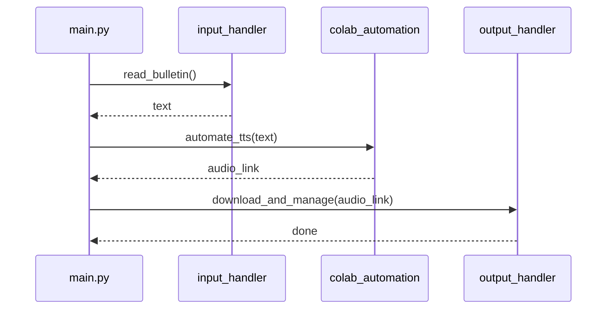

# Module 03 Sequence Diagram

Short: Sequence for Module 03 showing TTS automation flow.

```mermaid
sequenceDiagram
    participant M as main.py
    participant IH as input_handler
    participant CA as colab_automation
    participant OH as output_handler
    M->>IH: read_bulletin()
    IH-->>M: text
    M->>CA: automate_tts(text)
    CA-->>M: audio_link
    M->>OH: download_and_manage(audio_link)
    OH-->>M: done
```
